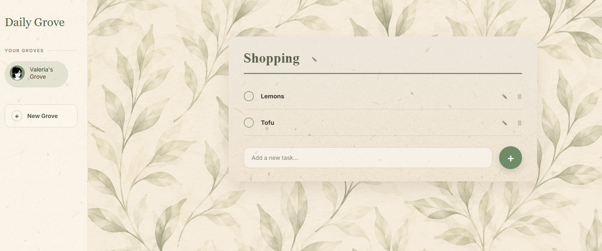
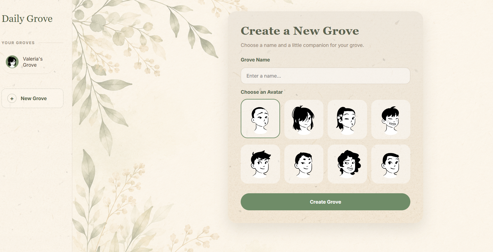

# Daily Grove

A cosy full-stack productivity web app built with Node.js, Express, EJS, and PostgreSQL.

Daily Grove allows users to create personalised “groves”, organise lists and daily tasks, and manage productivity inside a soft botanical-inspired interface.
---

## Features

- Multiple user groves
- Create and delete lists
- Add, edit, complete, and delete tasks
- Editable user profiles and avatars
- Dynamic motivational quote API integration
- Responsive layout for desktop and mobile
- PostgreSQL database storage
- Botanical / paper-inspired custom UI design

---

## Built With

- Node.js
- Express.js
- EJS
- PostgreSQL
- pgAdmin
- Render
- CSS3

---

## Live Demo

👉 https://daily-grove.onrender.com

> The app may take a few seconds to load initially because it is hosted on Render's free tier.
---

## Screenshots

### Homepage


### Tasks View



### Create Grove View



## Installation

Clone the repository:

```bash
git clone https://github.com/ValeriaBrizzolari/daily-grove.git
```

Move into the project folder:

```bash
cd daily-grove
```

Install dependencies:

```bash
npm install
```

---

## Environment Variables

Create a `.env` file in the root folder and add:

```env
DATABASE_URL=your_postgresql_connection_string
```

For local development, PostgreSQL must be installed and running.

---

## Database Setup

Create a PostgreSQL database called:

```txt
daily_grove
```

Run the following SQL:

```sql
CREATE TABLE users (
  id SERIAL PRIMARY KEY,
  name VARCHAR(50) NOT NULL UNIQUE,
  avatar_url TEXT,
  theme VARCHAR(30),
  created_at TIMESTAMP DEFAULT CURRENT_TIMESTAMP
);

CREATE TABLE lists (
  id SERIAL PRIMARY KEY,
  name VARCHAR(50) NOT NULL,
  user_id INTEGER REFERENCES users(id) ON DELETE CASCADE,
  created_at TIMESTAMP DEFAULT CURRENT_TIMESTAMP,
  UNIQUE(user_id, name)
);

CREATE TABLE tasks (
  id SERIAL PRIMARY KEY,
  title TEXT NOT NULL,
  list_id INTEGER REFERENCES lists(id) ON DELETE CASCADE,
  completed BOOLEAN DEFAULT FALSE,
  due_date DATE,
  created_at TIMESTAMP DEFAULT CURRENT_TIMESTAMP,
  UNIQUE(list_id, title)
);
```

---

## Run Locally

Start the server:

```bash
node index.js
```

Or with nodemon:

```bash
nodemon index.js
```

Open:

```txt
http://localhost:3000
```

---

## Deployment

This project is deployed using:

- Render (Web Service)
- Render PostgreSQL

---

## Author

Valeria Brizzolari

GitHub:
https://github.com/ValeriaBrizzolari
